# dioxus-diff-viewer - Architecture

> ⚠️ Automatically generated from related JSONL file; maintain using the Eidos Architect skill.

*local; DREAMED; ARCH-h2qwqte1g6*

Dioxus diff viewer crate built on a line diff engine.

**Activities**:

- Show the differences between two texts in Dioxus apps

**Responsibilities**:

- Crate identity and public vocabulary drawn from requirement terms

**Supports Requirements**: REQT-9273mztsx4, REQT-wxe0svnb22, REQT-x8e364jbqm


**Maturity**:

- DREAMED: 14/19
- consented: 3/19
- draft: 2/19

## In this document

[Components and Concerns](#components-and-concerns)&nbsp;&nbsp; [Components](#components)&nbsp;&nbsp; [Interactions](#interactions)&nbsp;&nbsp; [Software Objects](#software-objects)&nbsp;&nbsp; [Decisions](#decisions)&nbsp;&nbsp; [Design Patterns](#design-patterns)&nbsp;&nbsp; [Files](#files)&nbsp;&nbsp; [Collaboration Summary](#collaboration-summary)&nbsp;&nbsp; [Open Questions](#open-questions)&nbsp;&nbsp; [Discovery Notes](#discovery-notes)

## Components and Concerns


- [DiffViewer](#diffviewer-arch-m4dkxzw6hh) (internal): The Dioxus component apps mount to show two texts' differences, rendering the engine's output in split or inline view.
- [LineDiffEngine](#linediffengine-arch-jf3s5npp9s) (internal): Turns two texts and options into paired line information.
- [similar](#similar-arch-wdrt39xvh4) (external): Third-party Rust crate computing text alignment.


## Components

<a id="diffviewer-arch-m4dkxzw6hh"></a>

### Component: DiffViewer (internal; DREAMED - ARCH-m4dkxzw6hh)

The Dioxus component apps mount to show two texts' differences, rendering the engine's output in split or inline view.

**Activities**:

- Render split and inline views from a LineDiff
- Fold unchanged lines around changes
- Report line-number clicks to the app


**Exclusions** (boundary clarifications):
- Does NOT handle Whitespace-insensitive word, sentence, and CSS comparison (react-diff-viewer's WORDS, SENTENCES, CSS) - Not ported; the compare methods offered are character, word, line, and trimmed line, and CompareMethod leaves room for more.
- Does NOT handle Reporting whether a reset found any expanded fold (the boolean react-diff-viewer's resetCodeBlocks() returns) - The fold reset trigger only resets; reading fold state from app code belongs to programmatic control of the viewer.


**Supports Requirements**: REQT-2k7j51afde, REQT-qerexp825r, REQT-p2gkf77kjj, REQT-3ekk7hre3k, REQT-m9r3k5b1ge, REQT-3928hx46s3, REQT-zen8fyae28, REQT-78dg0g6a2h, REQT-q356bvvv15, REQT-kcm5ba45sp, REQT-sc8expw3q8, REQT-aaxrz33x1n, REQT-ef5a9d2paw

**Concerns and Responsibilities**:
- **Responsibility**: Rendering engine output without diffing again
- **Responsibility**: Expanded-fold state and its reset trigger
- **Responsibility**: Line highlighting and selection
- **Responsibility**: Consumer rendering of line content and fold rows
- **Responsibility**: Rendered content identity: line numbers within a text pair
- **Responsibility**: Styling hook classes on its markup
- **Responsibility**: Style delivery and theme selection
- **Responsibility**: Hover feedback on the row under the pointer


**Interactions**: [Line diff hand-off](#interaction-ARCH-atczcqvdsz)


---

<a id="linediffengine-arch-jf3s5npp9s"></a>

### Component: LineDiffEngine (internal; DREAMED - ARCH-jf3s5npp9s)

Turns two texts and options into paired line information.

**Activities**:

- Pair old and new lines
- Mark changes, line endings, and inline changes
- Number lines on each side


**Exclusions** (boundary clarifications):
- Does NOT handle Views, folding, and styling → see ARCH-m4dkxzw6hh (DiffViewer) - The engine carries no presentation.


**Supports Requirements**: REQT-czecf8krqc, REQT-xzc8n354h1, REQT-spzdk2z1pk, REQT-z9r0pc53jg, REQT-hmsfnfe5wc, REQT-dqxm8fa7ts, REQT-4nz35dscrn, REQT-9tze98pt6g, REQT-rtwn1qresp, REQT-hq1fzjaxg8, REQT-smd01rma2q

**Concerns and Responsibilities**:
- **Responsibility**: Line change marking as `similar` aligns lines
- **Responsibility**: Inline change tokens under each compare method
- **Responsibility**: Independent line numbering from the offset
- **Responsibility**: Positions of entries holding a change


**Interactions**: [Line diff hand-off](#interaction-ARCH-atczcqvdsz)


---

<a id="similar-arch-wdrt39xvh4"></a>

### Component: similar (external; DREAMED - ARCH-wdrt39xvh4)

Third-party Rust crate computing text alignment.

**Activities**:

- Align lines and tokens between two texts


**Interactions**: [Line diff hand-off](#interaction-ARCH-atczcqvdsz)


---


### Nested Components

> These components declare a `parentComponent` and should each have a separate architectural breakdown document. The summary here is a placeholder until that breakdown exists.

| Component | Parent | Summary |
|-----------|--------|---------|
| [DiffViewer](#diffviewer-arch-m4dkxzw6hh) | [dioxus-diff-viewer](#dioxus-diff-viewer-arch-h2qwqte1g6) | The Dioxus component apps mount to show two texts' differences, rendering the engine's output in split or inline view. |
| [LineDiffEngine](#linediffengine-arch-jf3s5npp9s) | [dioxus-diff-viewer](#dioxus-diff-viewer-arch-h2qwqte1g6) | Turns two texts and options into paired line information. |


## Interactions


<a id="interaction-ARCH-atczcqvdsz"></a>

### Interaction: Line diff hand-off (library_call; DREAMED - ARCH-atczcqvdsz)

[DiffViewer](#diffviewer-arch-m4dkxzw6hh), [LineDiffEngine](#linediffengine-arch-jf3s5npp9s), [similar](#similar-arch-wdrt39xvh4) - Trigger: The component renders with new texts or options.

The component asks the engine for a LineDiff and renders from it; the engine splits the lines itself and asks `similar` to align their texts.

**Payload**: two texts and LineDiffOptions; LineDiff

**Error**: None on text input: every pair of texts yields a LineDiff.
**Supports Requirements**: REQT-hmsfnfe5wc





---


## Data Flows


## Software Objects


<a id="software-object-ARCH-n7wmjnmt65"></a>

### LineDiffOptions (struct; DREAMED - ARCH-n7wmjnmt65)

**Component**: LineDiffEngine (ARCH-jf3s5npp9s)

```
compare method (character, word, line, trimmed line); inline changes on or off; line offset
```

The engine's input choices; the app sets them through the component.

**Supports Requirements**: REQT-czecf8krqc, REQT-xzc8n354h1, REQT-spzdk2z1pk, REQT-z9r0pc53jg, REQT-4nz35dscrn, REQT-smd01rma2q


<a id="software-object-ARCH-exgfx6rwdt"></a>

### LineDiff (struct; DREAMED - ARCH-exgfx6rwdt)

**Component**: LineDiffEngine (ARCH-jf3s5npp9s)

```
paired line entries in display order; positions of entries holding a change, including a pair whose terminators differ
```

The engine's output and the component's only input for views and folding.

**Supports Requirements**: REQT-hmsfnfe5wc, REQT-dqxm8fa7ts, REQT-rtwn1qresp, REQT-qcnxhemvhn


<a id="software-object-ARCH-kjjykjtt5r"></a>

### PairedLineEntry (struct; DREAMED - ARCH-kjjykjtt5r)

**Component**: LineDiffEngine (ARCH-jf3s5npp9s)

```
old side and new side, each optional with shared line text and line number; change kind (unchanged, removed, added, modified); inline change tokens on modified entries, each side's tokens marked unchanged, removed, or added and rejoining to that side's text; line ending change with each side's terminator; whether a modified pair differs in leading or trailing whitespace
```

One row of the diff as either view reads it.

**Supports Requirements**: REQT-hmsfnfe5wc, REQT-dqxm8fa7ts, REQT-4nz35dscrn, REQT-rtwn1qresp, REQT-hq1fzjaxg8, REQT-smd01rma2q


<a id="software-object-ARCH-y9545npjzg"></a>

### FoldResetTrigger (struct; draft - ARCH-y9545npjzg)

**Component**: DiffViewer (ARCH-m4dkxzw6hh)

```
an opaque copyable handle whose one action returns every expanded fold to folded
```

The optional prop through which an app resets folds, and nothing more. The crate creates it and owns the folds it acts on, so an app never names a fold; a viewer given none keeps its folds to itself.

**Supports Requirements**: REQT-869jyzdes7, REQT-v748c7mjr6


<a id="software-object-ARCH-rs0yp4vc5q"></a>

### LineContentRenderer (callback; DREAMED - ARCH-rs0yp4vc5q)

**Component**: DiffViewer (ARCH-m4dkxzw6hh)

```
a whole line or one inline-change token, as shared line text with a range, to rendered content
```

Optional; lets an app shape line text, as for syntax highlighting. The viewer keeps the change wrapping around each token, so on modified lines the renderer sees fragments. Line text is shared with the engine output, so no call copies it.

**Supports Requirements**: REQT-vxtax4x0vs


<a id="software-object-ARCH-jakkqkh6e1"></a>

### FoldRowRenderer (callback; DREAMED - ARCH-jakkqkh6e1)

**Component**: DiffViewer (ARCH-m4dkxzw6hh)

```
hidden-line count, and the first hidden line's old and new numbers, to rendered content
```

Optional; replaces the default fold-row text. Receives document coordinates only, never a fold identity.

**Supports Requirements**: REQT-1tdrfvay4q


<a id="software-object-ARCH-sx4az00gan"></a>

### LineNumberClickHandler (callback; DREAMED - ARCH-sx4az00gan)

**Component**: DiffViewer (ARCH-m4dkxzw6hh)

```
the clicked line's id, as in L-20, and the modifier keys held; returns nothing
```

Optional; with highlighted lines, lets an app build line and range selection. Modifier keys travel as plain data rather than the framework's event.

**Supports Requirements**: REQT-bqm9w6v4ms, REQT-zaens35zqy


<a id="software-object-ARCH-mt182qa8vt"></a>

### LineId (enum; DREAMED - ARCH-mt182qa8vt)

**Component**: DiffViewer (ARCH-m4dkxzw6hh)

```
old or new side plus a line number; text form `L-20` or `R-3`, readable back from text
```

How an app names a line, both to highlight it and in each line-number click.

**Supports Requirements**: REQT-zaens35zqy, REQT-bqm9w6v4ms, REQT-jgkndzqkyz


<a id="software-object-ARCH-38ktaqm4xw"></a>

### StylingHookClasses (constants; draft - ARCH-38ktaqm4xw)

**Component**: DiffViewer (ARCH-m4dkxzw6hh)

```
one `dxdiff` class per element kind, plus view classes, state classes (unchanged, removed, added, modified, empty, highlighted), and a class on a gutter that reports its clicks
```

The public class vocabulary apps and the theming unit style against, independent of element structure. The clickable-gutter class is what lets a hover affordance reach only the gutters that answer a click, which is what makes the reference's gutter hover carryable.

**Supports Requirements**: REQT-3928hx46s3


<a id="software-object-ARCH-d87pprx5vn"></a>

### ThemePalette (constants - ARCH-d87pprx5vn)

**Component**: DiffViewer (ARCH-m4dkxzw6hh)

```
one `--dxdiff`-prefixed custom property per theme color, defaulted at the document root, redeclared for the dark theme, and carried on a viewer given an explicit theme
```

What an app reassigns to restyle the viewer; the stylesheet reads nothing else for color.

**Supports Requirements**: REQT-78dg0g6a2h, REQT-1accrb4jhp, REQT-8y5fp2aarz, REQT-ef5a9d2paw


<a id="software-object-ARCH-7kwnstr5rt"></a>

### DiffTheme (enum - ARCH-7kwnstr5rt)

**Component**: DiffViewer (ARCH-m4dkxzw6hh)

```
auto, light, or dark; auto follows the reader's color-scheme preference
```

The prop choosing a viewer's palette, written onto the viewer element so two mounted viewers may differ.

**Supports Requirements**: REQT-sc8expw3q8


## Decisions


<a id="decision-ARCH:dcisn-wma0h4mndz"></a>

### Engine separate from component (accepted; DREAMED - ARCH:dcisn-wma0h4mndz)

**Subject**: LineDiffEngine (ARCH-jf3s5npp9s)

**Context**: Views and folding need line diff information without diffing inside rendering.

> **Situation**: The reference component calls its line computation during rendering (`src/index.tsx:479`).
>
> **Impact**: Diffing inside the component ties engine tests to a renderer and repeats work across renders.
>
> **Vision**: A presentation-free engine whose output the component renders.

The engine returns a LineDiff from two texts and LineDiffOptions; the component builds split and inline views and folding from that output alone.


**Also involves**:
- DiffViewer (ARCH-m4dkxzw6hh): Renders views and folding from LineDiff alone


<a id="decision-ARCH:dcisn-zyt966vq09"></a>

### Engine tokenizes lines, similar aligns them (accepted; DREAMED - ARCH:dcisn-zyt966vq09)

**Subject**: LineDiffEngine (ARCH-jf3s5npp9s)

**Context**: Line identity must ignore terminators while each terminator stays reportable.

> **Situation**: `similar`'s line tokenizer keeps `\n`, `\r\n`, and a bare `\r` inside each line token.
>
> **Impact**: Lines with the same text and different terminators never match, so unchanged lines read as modified.
>
> **Vision**: The engine splits lines, holds each terminator aside, and hands `similar` only the line texts.

The engine owns line tokenization; `similar` aligns the resulting line texts and the tokens within a modified pair.


**Also involves**:
- similar (ARCH-wdrt39xvh4): Aligns the line texts the engine hands it


**Supports Requirements**: REQT-hmsfnfe5wc, REQT-rtwn1qresp


<a id="decision-ARCH:dcisn-pgydgmajhx"></a>

### Themes shipped as one layered stylesheet (accepted - ARCH:dcisn-pgydgmajhx)

**Subject**: DiffViewer (ARCH-m4dkxzw6hh)

**Context**: The viewer needs consumer style overrides, and emotion style objects have no Rust counterpart.

> **Situation**: The reference builds every rule at runtime from a per-instance `styles` prop through emotion (`src/styles.ts:78-145`).
>
> **Impact**: A Rust port of that shape would need a typed field per CSS declaration and would still reach less than CSS does.
>
> **Vision**: One stylesheet the crate embeds, whose colors are named custom properties an app reassigns in its own CSS.

The viewer renders its embedded stylesheet through `document::Style`, inside a cascade layer, so an app's own rules take effect at any specificity.


**Supports Requirements**: REQT-q356bvvv15, REQT-kcm5ba45sp, REQT-1accrb4jhp, REQT-ey9f1s27r1


## Design Patterns


## Files


## Collaboration Summary


## Open Questions


## Discovery Notes


